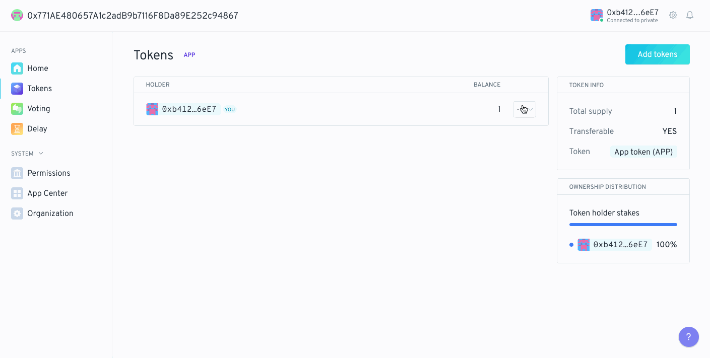
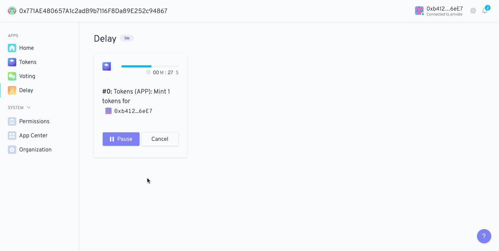
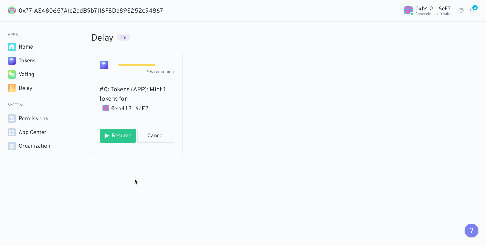
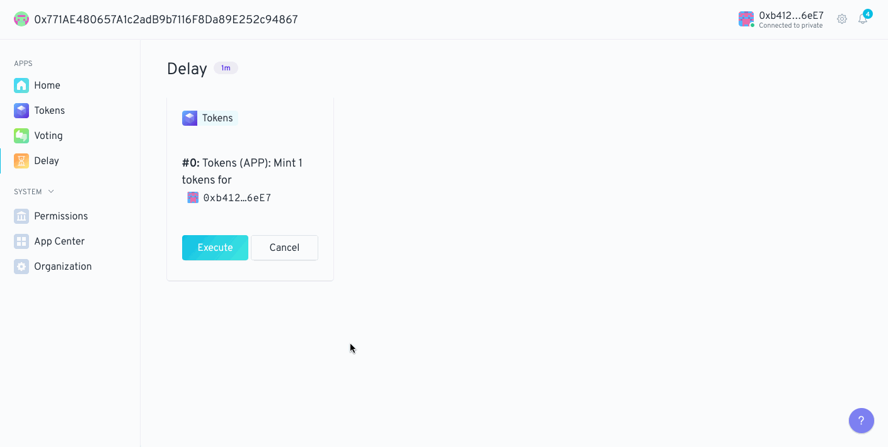
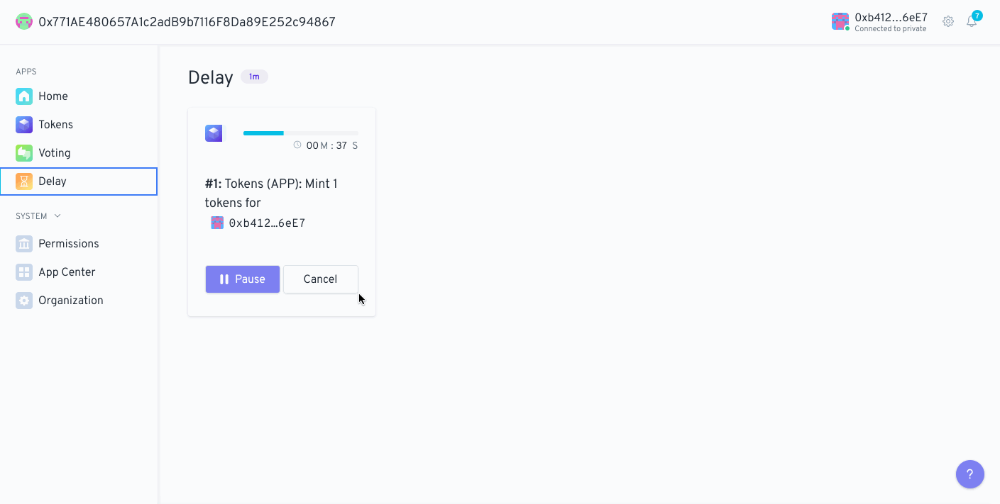

 

## What is the Delay app?

The Delay app is a [forwarder](https://hack.aragon.org/docs/forwarding-intro). It can delay, pause, and resume forwarding of an intent.

 

## Using the Delay app

Addresses with the `DELAY_EXECUTION_ROLE` will be able to create delayed actions.

There are 4 main actions a user can take relative to a script:

- Pause a delayed script
- Resume a delayed script
- Execute a delayed script
- Cancel a delayed script

### Creating a delayed action

In this example we have set up the DAO so the voting app can create delayed actions and the delay app can mint tokens. This menas that when trying to mint some org tokens, you'll have to create a vote first, which if approved, the action will be delayed for 1 minute.

    

### Pause a delayed action

Pausing a script is pretty straight forward. Just click the `Pause` button of the script you would like to pause and create the transaction. In order to be able to execute the script, you will have to resume it back again and wait for the delay period to expire.

    

### Resume a delayed action

For scripts that are currently paused, you can click the `Resume` button and create the transaction. After the transaction is mined you should see the progress bar active again with the time remaining for execution.

    

### Execute a delayed action

After the delay period for a script elapses, anyone can execute the script. Just click in the `Execute` button and create the transaction. After the transaction is mined, the action will be executed and the script no longer visible in the UI.

    

### Cancel a delayed action

A script can be cancelled at any time, even if the delayed period has already elapsed. Click in the `Cancel` button and create the transaction. After the tx is mined the script won's have executed and it should be no longer visible in the UI.

    

